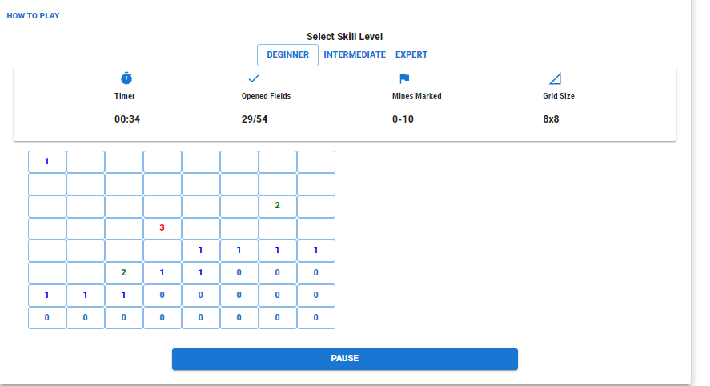
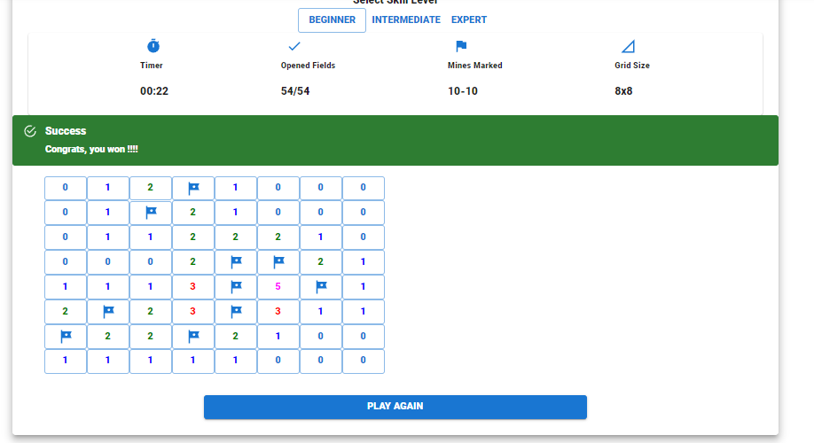
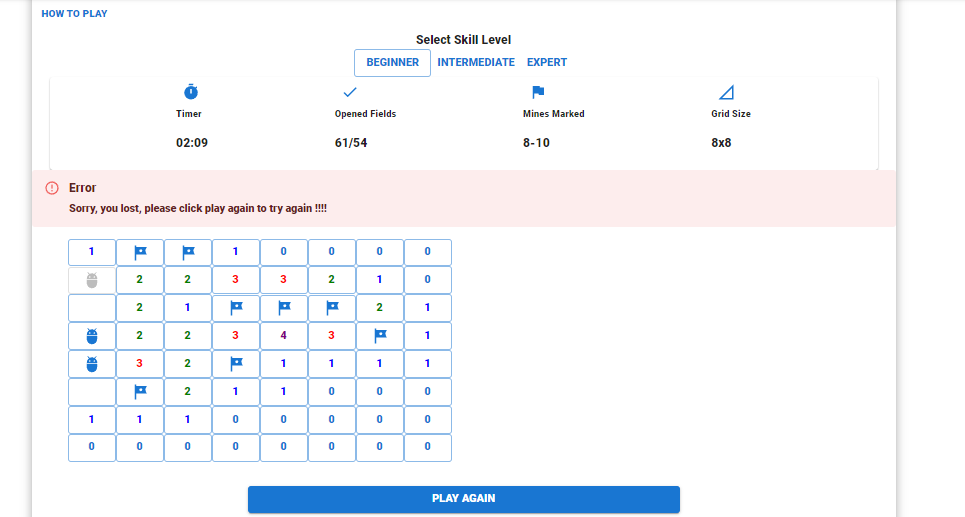
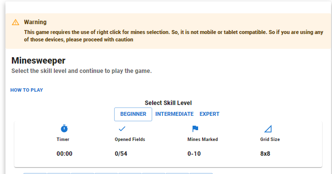

# Classic Mine Sweeper Game

#### created using Typescript and MUI-core (formerly called Material-UI)

## Getting Started

Install this package:

```shell
npm install mui-minesweeper
```

Import the Counter component:

```js
import { Minesweeper } from "mui-minesweeper";
```

You can then render the `Minesweeper` component like any other React component in JSX.

Rendering this module in your application will also enable you to have a capability to select the difficulty level as below


| Skill        | xFieldsCount              | yFieldCount               | bombCount                |
| ------------ | ------------------------- | ------------------------- | ------------------------ |
|              | Number of boxes in x-axis | Number of boxes in y-axis | Number of bombs on board |
| Beginner     | 8                         | 8                         | 10                       |
| Intermediate | 16                        | 16                        | 40                       |
| Expert       | 30                        | 16                        | 99                       |



##### Bombs selection on board is completely random and every new page load or render of the component will have bombs in different places

### Won

When the user wins the game


### Loss

When the user wins the game


### Since this game uses right click to select mines, it is difficult to play on laptop or mobile devices and so in those devices, following warning is shown


